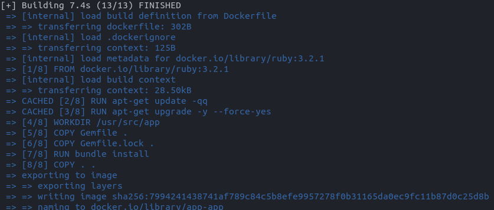
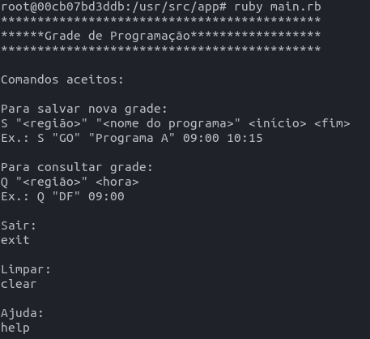

## PRE-SETUP

- Necessário ter o `docker` e `docker compose` e `git`
- Para instalação docker e docker compose acesse: [DOCKER](https://docs.docker.com/engine/install/ubuntu/), [POST-INSTALL](https://docs.docker.com/engine/install/linux-postinstall/), [DOCKER COMPOSE](https://docs.docker.com/compose/)
- `docker compose version # Docker Compose version v2.12.2` versão que foi relaizado a primeira configuração

## SETUP

- Clone o projeto `git clone https://github.com/SelecaoGlobocom/horecio_dias`
- Acess a pasta `app`: `cd horecio_dias/app`
- Rode `docker compose build`
- Se tudo ocorrer bem, algo semelhante a imagem abaixo será o resutlado:



- Agora acesse o `container` com o seguinte comando: `docker compose run app bash`
- Agora está dentro do terminal do `container` com todas as dependências instaladas algo assim: `root@0bcadb299be1:/usr/src/app#`

## RUN

 - Para rodar a aplicação, já dentro do container, rode: `ruby main.rb`
 - Se tudo ocorreu bem aparecerá o seguinte resultado:



## 1 - Grade de programação

O sinal da TV Globo é geolocalizado, dependendo de onde você está um programa
diferente está passando. Um exemplo disso são os jornais locais: RJTV, SPTV,
DFTV etc.

Quando não existe um programa regional é utilizado o sinal nacional, logo,
alguns programas passam em todo o território.

Para este desafio você deverá escrever um programa que recebe os dados da grade
de programação e responde a algumas perguntas. O formato de entrada/saída e os
tipos de pergunta são definidos abaixo.

### Entrada de dados, cadastro de grade

- Cada registro é dado em uma única linha
- Formato: `S <região> <nome do programa> <início> <fim>`
- Exemplo, Bom Dia DF passa às 6 da manhã -> `S "DF" "Bom Dia DF" 06:00 07:30`

### Entrada de dados, consulta de grade

- Cada registro é dado em uma única linha
- Formato: `Q <região> <hora>`
- Exemplo: Qual programa passa no DF às 6 da manhã? -> `Q "DF" 06:00`

### Saída de dados, respostas as consultas

- Cada resposta é dada em uma única linha
- Formato: `A <Q_região> <hora> <S_região> <nome do programa>`
- Quando não houver programaçao disponível: `A <Q_região> <hora> noise`
- Exemplo: Bom dia DF é o programa que passa às 6 da manhã no DF -> `A "DF" 06:00 "DF" "Bom Dia DF"`
- Exemplo: Não existe um programa passando às 3 da manhã no DF -> `A "DF" 03:00 noise`

### Exemplos

----
Entrada:
```
S "GO" "Hora Um" 05:00 06:00
S "BR" "Globo Rural" 05:00 06:00
Q "GO" 05:30
Q "SP" 05:28
```
Saída:
```
A "GO" 05:30 "GO" "Hora Um"
A "SP" 05:28 "BR" "Globo Rural"
```
----
Entrada:
```
S "DF" "Bom dia DF" 06:01 07:29
S "RJ" "Bom dia RJ" 06:01 07:29
S "SP" "Bom dia SP" 06:01 07:29
Q "RJ" 07:00
Q "GO" 06:50
```
Saída:
```
A "RJ" 07:00 "RJ" "Bom dia RJ"
A "GO" 06:50 noise
```


