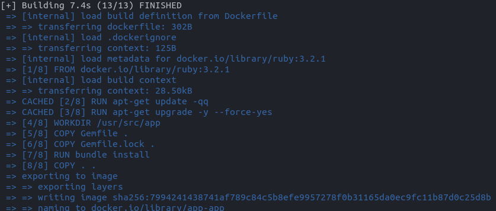
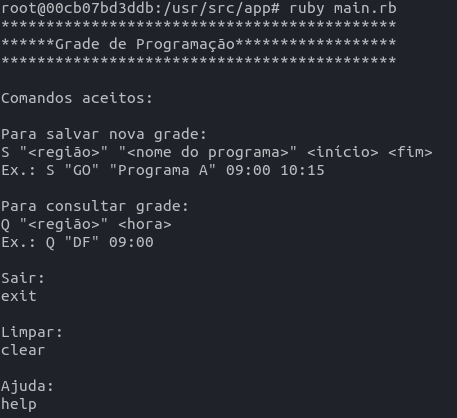

## PRE-SETUP

- Necessário ter o `docker` e `docker compose` e `git`
- Para instalação docker e docker compose acesse: [DOCKER](https://docs.docker.com/engine/install/ubuntu/), [POST-INSTALL](https://docs.docker.com/engine/install/linux-postinstall/), [DOCKER COMPOSE](https://docs.docker.com/compose/)
- `docker compose version # Docker Compose version v2.12.2` versão que foi relaizado a primeira configuração

## SETUP

- Clone o projeto `git clone https://github.com/SelecaoGlobocom/horecio_dias`
- Acess a pasta `app`: `cd horecio_dias/app`
- Rode `docker compose build`
- Se tudo ocorrer bem, algo semelhante a imagem abaixo será o resutlado:

- Agora acesse o `container` com o seguinte comando: `docker compose run app bash`
- Agora está dentro do terminal do `container` com todas as dependências instaladas algo assim: `root@0bcadb299be1:/usr/src/app#`

## RUN

 - Para rodar a aplicação, já dentro do container, rode: `ruby main.rb`
 - Se tudo ocorreu bem aparecerá o seguinte resultado:

